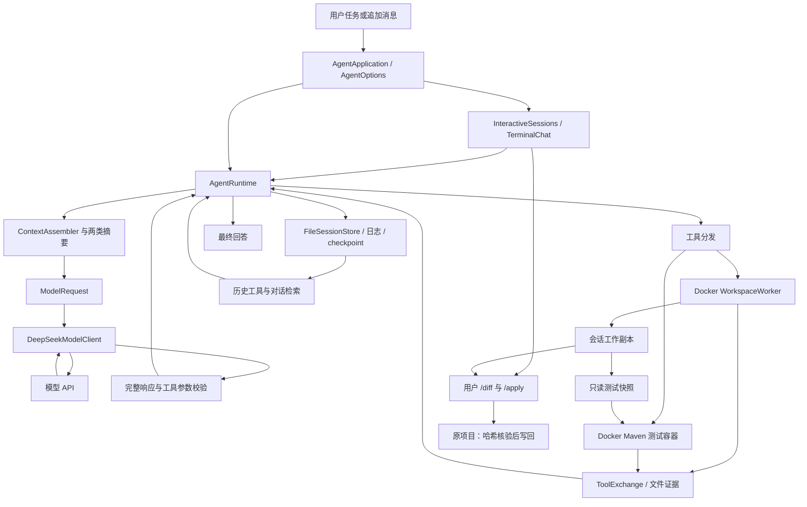

# Backend Engineer Agent

基于 Java 21 的 Coding Agent。用户通过自然语言描述任务，模型自主探索 Java 仓库、修改或创建文件、运行测试，并根据工具结果继续处理。支持终端连续对话，在同一个持久化会话中追加和修改需求。

项目重点是**上下文治理、证据时效性和执行恢复**：让长历史能够压缩、按需检索，同时区分“过去看到的结果”和“当前仍有效的结果”。文件操作与测试在 Docker 隔离副本中执行，模型请求和会话管理留在宿主机编排侧。

这是面向小型 Java 仓库的个人研发项目，已完成核心执行链路和真实任务验证。

## 核心能力

| 能力 | 实现 |
| --- | --- |
| 自主执行闭环 | 目录探索、代码搜索、文件读写、差异检查、Maven 测试反馈 |
| 分层上下文 | 预算充足时保留短历史；长历史采用近期完整批次、中期增量摘要、远期检索；对话摘要独立维护 |
| 证据时效性 | 文件 SHA-256 与工作区版本识别过期读取、搜索和测试证据；旧正文默认隐藏 |
| 历史检索与记忆 | 检索工具记录和过往对话，按需提取原文；保存带来源引句的工作记忆 |
| 会话恢复 | 日志、checkpoint 和工作区哈希联合校验；支持预算停止、失败及部分工具批次恢复 |
| 容器隔离 | 文件 worker 与测试容器只访问过滤后的工作副本；结果通过 /apply 显式写回或导出 |
| 会话管理 | 列表、切换、新建与确认删除；历史、副本、摘要、调用额度及同步基准按 UUID 隔离 |
| 模型失败处理 | 保存安全诊断，任务请求最多两次额外重试，计入累计调用预算 |

## 快速开始

前置条件：JDK 21、Maven 3.8.7 或以上、本机 Linux Docker。最近验证使用 Maven 3.9.9。构建和镜像准备需要下载依赖；运行测试工具使用镜像内预装依赖，离线执行。

```bash
mvn clean verify
docker build -f sandbox/Dockerfile -t backend-agent-sandbox:local .
cp agent-local.properties.example agent-local.properties
```

配置文件已存在时跳过最后一步。在编辑器中填写 `agent-local.properties` 的 `model.api-key`，不要加引号。本地配置已被 Git 忽略；没有密钥时可以先查看帮助或运行普通回归测试。

```bash
java -jar target/backend-engineer-agent-1.0.0.jar --help
java -jar target/backend-engineer-agent-1.0.0.jar \
  --interactive --workspace examples/test-repair \
  --config agent-local.properties --max-model-calls 60
```

看到 `你>` 后可直接输入需求，也可先用 `/sessions` 查看历史会话、`/open UUID` 打开、`/new` 新建，`/delete UUID` 删除非当前会话（需明确确认）。每轮完成后可以继续输入。`/diff` 查看副本相对原项目的改动，`/apply` 写回原项目，`/status` 查看状态，`/budget N` 设置累计上限，`/resume` 恢复未完成轮，`/exit` 退出。退出后使用 `--interactive --continue-session <UUID>` 接入已完成会话，无需附加 `--message`。

也保留单次任务入口：

```bash
java -jar target/backend-engineer-agent-1.0.0.jar \
  --workspace examples/test-repair \
  --task "先运行测试定位失败，修复Calculator.add实现，不修改现有测试预期，再运行测试并解释结果" \
  --config agent-local.properties \
  --max-model-calls 16
```

示例故意把加法写成减法，方便观察“测试失败 → 修改 → 测试通过”。正式运行会使用模型 API 额度和 Docker。控制台打印 Session ID、隔离目录、执行事件和最终回答；文件改动保存在 `.agent-sessions/<session-id>/workspace`，原始示例仅在你执行 `/apply` 后同步。

详见 [完整演示步骤](docs/DEMO.md)，包括追加需求、恢复、查询和导出。

## 架构



模型选择动作；运行时控制执行、调用预算和持久化。完整响应通过校验后，按顺序执行工具批次；执行结果按 `tool_call_id` 配对回传模型。

详见 [架构与设计取舍](docs/ARCHITECTURE.md)。

## 多轮与恢复

将启动时打印的 UUID 填入 `SESSION_ID`，各命令沿用同一来源目录和数据目录：

```bash
SESSION_ID='替换为会话UUID'
java -jar target/backend-engineer-agent-1.0.0.jar \
  --workspace examples/test-repair --continue-session "$SESSION_ID" \
  --message "补充负数和零值测试，保留已有测试，然后运行测试" \
  --config agent-local.properties --max-model-calls 30
```

| 会话状态 | 入口 | 含义 |
| --- | --- | --- |
| COMPLETED | `--continue-session` + `--message` | 在原会话追加一轮需求 |
| BUDGET_EXHAUSTED | `--resume-session` | 继续未完成当前轮 |
| FAILED 或可核验的工具中断 | `--resume-failed-session` | 恢复当前轮及已有工具进度 |

`--max-model-calls` 是整个会话的累计上限，任务请求、摘要和失败重试都计入。恢复时必须高于已用次数。没有结果确认的工具重试需要 `--retry-incomplete-tool true`，且执行前哈希必须与恢复现场一致；文件已变化的未知写入拒绝盲目重放。

## 测试结果

最近一次回归共 364 项：361 项通过、3 项 Docker 集成测试默认跳过，失败与错误均为 0。此前单独运行的 3 项 Docker 集成测试全部通过。

已验证代码读写、测试反馈、上下文压缩、历史检索、会话恢复、会话切换、写回冲突检查和删除保护。详见 [测试结果](docs/VALIDATION.md)。

## 当前边界

- 终端交互支持连续单行输入，模型回答仍为非流式；尚无Web UI、REST服务或自动跨任务长期记忆检索。
- 文件工具面向过滤后的文本仓库：最多 1000 文件、16 MiB 总量、单文件 256 KiB；会话最多 32 个用户轮次。
- `run_tests` 执行固定离线 Maven 命令；新项目依赖未预装时，需要由开发者先准备镜像，不支持任意命令执行。
- 请求预算采用 UTF-8 字节的保守估算，尚未接入模型专用 tokenizer；摘要引句校验能证明来源，不能证明模型推论正确。
- COMPLETED 表示模型结束当前轮；实际测试是否通过、是否过期，需检查工作区测试状态。恢复不能覆盖所有崩溃、未知文件副作用或日志损坏。
- Docker 隔离已限制网络、挂载和进程权限；面向本机 Linux 使用，尚未验证 Windows、远程 Docker 或对抗性环境。

## 文档与源码导航

| 内容 | 入口 |
| --- | --- |
| 运行与多轮演示 | [docs/DEMO.md](docs/DEMO.md) |
| 架构、上下文与恢复设计 | [docs/ARCHITECTURE.md](docs/ARCHITECTURE.md) |
| 测试结果 | [docs/VALIDATION.md](docs/VALIDATION.md) |
| 编排与上下文 | [runtime](src/main/java/dev/backendagent/runtime) |
| 模型请求与适配器 | [model](src/main/java/dev/backendagent/model) |
| 工具与容器执行 | [tools](src/main/java/dev/backendagent/tools)、[sandbox](src/main/java/dev/backendagent/sandbox) |
| 持久化与历史检索 | [persistence](src/main/java/dev/backendagent/persistence)、[history](src/main/java/dev/backendagent/history) |
