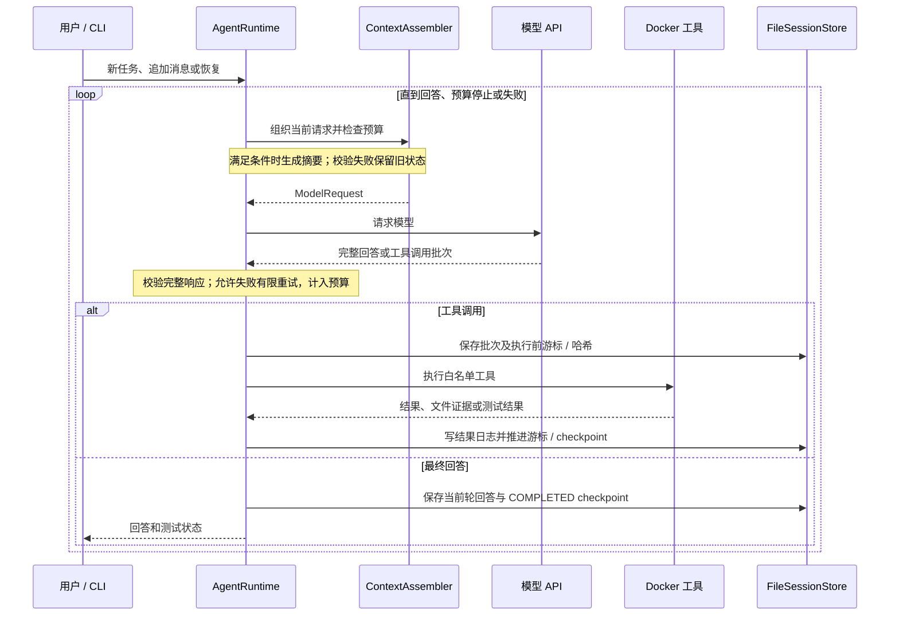
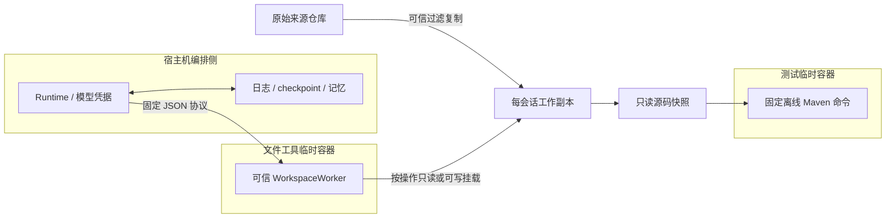

# 架构与设计取舍

项目以同步、单工作线程运行一个会话。模型负责选择动作，Java 运行时负责执行顺序、预算、证据和持久化。当前模型适配器使用非流式、非思考模式的 Chat Completions 工具调用协议。

## 模块职责

| 模块 | 主要类 | 职责 |
| --- | --- | --- |
| 入口 | AgentApplication、AgentOptions、InteractiveSessions、TerminalChat、AgentConfigLoader | 选择新任务、追加需求、恢复、查询或导出；装配依赖 |
| 编排 | AgentRuntime、AgentSession、PendingToolBatch | 主循环、工具批次游标、用户轮次和会话状态 |
| 上下文 | ContextAssembler、ContextCompactor、ConversationCompactor | 请求组织、完整预算、两类摘要及降级 |
| 模型 | DeepSeekModelClient、ModelRequest、ModelResponse | 编码请求、校验响应、解析工具参数与安全诊断 |
| 工具 | tools 包 | 文件操作、测试、记忆和历史检索 |
| 隔离 | DockerWorkspace、WorkspaceWorker、DockerSandboxExecutor | 固定协议的文件容器、固定命令的测试容器 |
| 存储 | FileSessionStore、SessionCheckpoint、ObservationArchive | 日志、检查点、原始工具证据及恢复核验 |

## 终端输入与执行分离

`--interactive`由AgentOptions识别为无值开关。新会话先读取第一条需求，再创建AgentSession与工作副本；已有COMPLETED会话直接进入提示符。TerminalChat只负责输入、命令、简短输出，通过Runtime工厂按当前累计上限执行。

CREATED调用run，COMPLETED收到新需求调用continueConversation，BUDGET_EXHAUSTED/FAILED在用户主动恢复时使用已有恢复入口；终端 `/open` 只加载，不自动执行。每次执行后保存快照；额度耗尽或当前轮失败不接受新消息。`/budget`改变本进程累计上限，不清空历史或额度统计，也不改变API输出预算。退出释放会话锁，后续可从checkpoint重新接入。

## 会话选择、写回与删除

终端会话选择由 InteractiveSessions 管理。每个 Attachment 拥有 AgentSession、独立 FileSessionStore、绑定当前 workspace/archive/session 的工具与 runtimeFactory、WorkspaceSynchronizer 和调用上限。生产环境只保留一个活动附件；候选会话完成校验后才替换旧附件并释放锁，重新进入旧会话时从它自己的 checkpoint 恢复。共享的 ModelClient 只负责无会话状态的HTTP请求，消息由当前 AgentSession 组装。/open 不执行模型或工具恢复，未完成轮需用户 /resume。

删除生命周期由 FileSessionStore.prepareDeletion 和 SessionDeletion 管理：使用正常会话锁保护预览、确认和目录移除；只允许删除 UUID 定位的非当前会话目录。目录原子移出公开 UUID 路径后，递归清理不跟随符号链接。删除确认属于终端命令输入，不进入 AgentSession 对话历史；原项目不参与删除。未写回提示复用 WorkspaceSynchronizer 的比较规则，无法核验时报告未知。

会话选择成功后释放旧锁；失败则保留旧会话。`/new` 从原项目创建新副本，未写回的旧修改不会随之复制。显式写回位于宿主机可信同步层，文件工具仍只操作副本；两个会话写回同一文件时，各自基准哈希防止相互覆盖。

## 执行链路



每次模型响应可包含多个工具；运行时依次执行，保留完整批次。需要上一条工具结果的调用由模型在后续请求中提出。模型不会直接执行 Java 代码；`ProcessBuilder` 启动固定 Docker 命令，容器里的 worker 或 Maven 才执行文件操作或测试。

## 上下文：两个摘要维度，共用一份原始工具历史

| 信息 | 默认组织方式 | 原始内容 |
| --- | --- | --- |
| 当前用户轮 | 完整保留当前需求与执行历史中选中的批次 | 会话状态与日志 |
| 工具历史近期 | 短历史不超过 12 个完整批次且过滤后正文放得下预算时完整保留；超出此范围或预算不足时保留最近 4 个完整批次，受预算限制 | 原结果日志 |
| 工具历史中期 | 前 8 个批次候选，累计 4 个新合格批次时尝试增量摘要 | 原结果日志 |
| 对话近期 | 当前轮及最近 2 个完成轮次保留原消息 | ConversationTurn 与日志 |
| 对话中期 | 前 8 个完成轮候选，达到 4 个新合格轮次时尝试摘要 | 原始用户消息与回答 |
| 更远历史 | 退出默认正文和可见摘要窗口，按需检索 | 文件归档保留；部分内存元数据仍存在 |

工具摘要 `ContextSummary` 记录操作与观察；对话摘要 `ConversationSummary` 记录用户要求、修改关系和当时回答。两者分别保存，不把用户约束混成工具结果。工具记录跨用户轮次沿用同一份历史，没有按轮删除旧执行结果。

为保持工具消息的对话顺序，拥有当前选中工具批次的旧用户轮次可能仍保留原文；近期保留策略也受完整请求预算约束。因此不是严格按轮数切断所有文本。

已经成功摘要并覆盖的原始记录不会作为新原文反复输入；后续输入由旧摘要与新增合格原文组成，允许对旧摘要做合并。失败候选不安装，之后按原间隔重试。正文不足默认 2048 字符跳过模型摘要，避免短记录摘要反而增大。

摘要须使用真实来源 ID 和连续原文引句，禁止新建 NEXT_STEP，验证大小、收益、覆盖范围与时效性后才安装。工具摘要还做保守去重。引句验证证明来源存在，不保证摘要推论正确；拒绝后保留原摘要，使用规则裁剪继续。

完整请求预算覆盖系统提示、工具定义、两类摘要、原始消息、工具结果、JSON包装及输出预留。UTF-8 字节数作为保守输入估算，与真实计费 token 有区别。

上下文投影策略 v4 先过滤过期证据，再判断短历史能否完整保留。最近 12 个批次的原始结果保留在会话内存中，超过后仍卸载远期长正文。历史索引最多 2000 字符，新增路径、successful、validity：CURRENT 表示有文件指纹证据且未被托管写入失效，STALE 表示已失效，无可验证证据为 UNKNOWN。CURRENT 不是永久有效保证，历史提取仍执行现有核验。保留了原文的摘要条目不重复发送，持久化摘要不修改。旧投影 v1–v3 按原规则校验恢复，新请求采用 v4。

## 证据时效性与历史检索

读取、搜索及写入相关证据携带文件指纹；测试记录关联工作区 revision。写入后旧文件证据失效，工作区版本递增，旧测试标为过期。历史操作的发生事实仍存在，但旧正文默认从当前请求隐藏。

| 工具 | 作用 |
| --- | --- |
| search_history | 按工具、路径或字面关键词找历史调用 ID、匹配行和时效性 |
| read_observation | 按调用 ID 提取历史结果原文；历史行号不等于当前文件行号 |
| search_turns | 检索旧用户消息或回答，返回消息 ID 与后续轮次提示 |
| read_turn | 提取原对话；返回 HISTORICAL_ONLY 标记，不提升为当前约束 |
| remember_fact | 保存带工具来源和引句的工作记忆；加载时复核 |

主动检索到的旧证据进入独立、有界的历史证据区，避免刚取回就被默认过期过滤隐藏。需要当前文件内容或测试结论时必须重新读取或运行测试；存在后续用户轮次不代表所有旧约束都已撤销。

## 容器与存储边界



文件容器普通用户运行、禁联网、只读根文件系统、限制 CPU/内存/进程；模型不能选择镜像、挂载和任意命令。API 配置、会话日志、Docker socket 和宿主机 Maven 缓存不挂载。测试依赖来自镜像预装仓库，源码快照只读，构建输出位于容器内。

源码副本持续保留，每次工具调用的容器结束即销毁。来源仓库不自动同步。用户通过 `/diff` 查看改动、`/apply` 显式写回，或导出到新目录。`WorkspaceSynchronizer` 是可信宿主机同步组件，不向模型暴露写回工具；基于原文/上次同步哈希检查冲突，并将成功同步哈希保存在 source-sync.json。同步不修改隔离副本、模型历史或 checkpoint 状态。

## checkpoint 与部分批次恢复

`SessionCheckpoint` 保存工具历史、用户轮次、两类摘要、记忆、工作区版本及哈希、测试状态和失败边界。恢复同时核对 JSON、连续日志、原始工具结果与工作区现场，持有会话锁，不靠单个 JSON 文件直接相信所有状态。

`PendingToolBatch` 保存批次调用序号、完整工具列表、下一条索引、in-flight 状态和执行前哈希：

```text
执行前保存批次 / 游标 → 标记当前工具 in-flight 并保存前置哈希
→ 执行工具 → 记录结果 → 推进游标并保存 checkpoint
```

已记录结果的工具保留，恢复先执行剩余工具，再调用模型。没有结果的 in-flight 工具必须显式授权重试，并验证文件未改变；哈希不同则拒绝盲目重放。这里提供可核验边界上的恢复，不保证所有外部副作用恰好执行一次。

## 模型失败处理与取舍

`ModelFailureDiagnostic` 使用固定枚举记录失败分类与结束原因，不持久化原始失败响应。任务请求最多三次尝试，使用相同上下文，每次计入预算，校验失败的部分工具不执行。

网络异常、特定临时 HTTP 错误与格式错误可以重试；输出耗尽 LENGTH 不用同样上限自动重试，可调整配置后显式恢复。摘要质量失败保持原降级流程，持久化故障直接停止。

固定窗口、同步执行、文件存储使执行过程容易追踪和验证；代价是跨轮元数据仍占内存、每工具检查点和临时容器增加开销，目前尚无大仓库性能基准或并发服务实现。

[返回项目首页](../README.md) · [测试结果](VALIDATION.md)
